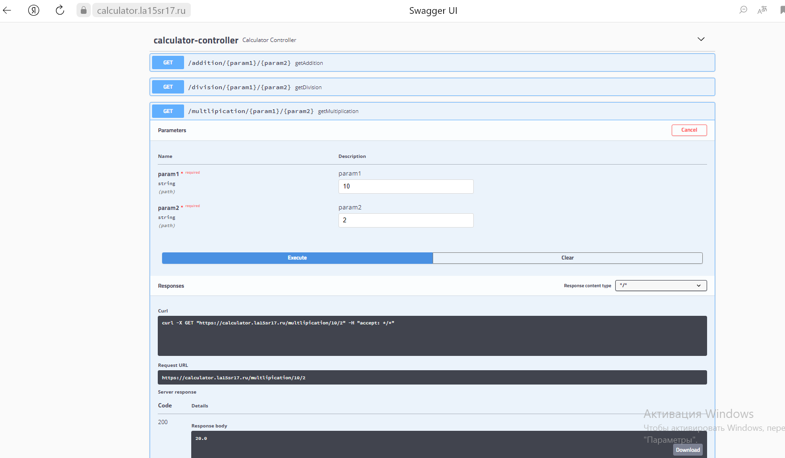

# Документация API калькулятора на Swagger

## Введение

Эта документация описывает методы API калькулятора, который поддерживает четыре арифметические операции: сложение, вычитание, умножение и деление. API предоставляет четыре конечные точки, каждая из которых выполняет одну из перечисленных операций.

## Как использовать Swagger?
Переходим по ссылке: https://calculator.la15sr17.ru/swagger-ui.html#

## Спецификации API

### 1. Сложение

- **URL**: `/addition/{param1}/{param2}`
- **Метод**: `GET`
- **Описание**: Возвращает сумму двух чисел.
- **Параметры**:
    - `param1`: первый аргумент (число).
    - `param2`: второй аргумент (число).

### 2. Деление

- **URL**: `/division/{param1}/{param2}`
- **Метод**: `GET`
- **Описание**: Возвращает результат деления `param1` на `param2`.
- **Параметры**:
  - `param1`: делимое (число).
  - `param2`: делитель (число).

### 3. Умножение

- **URL**: `/multlipication/{param1}/{param2}`
- **Метод**: `GET`
- **Описание**: Возвращает произведение двух чисел.
- **Параметры**:
  - `param1`: первый множитель (число).
  - `param2`: второй множитель (число).

### 4. Вычитание

- **URL**: `/subtraction/{param1}/{param2}`
- **Метод**: `GET`
- **Описание**: Возвращает разность `param1` и `param2`.
- **Параметры**:
  - `param1`: уменьшаемое (целое число).
  - `param2`: вычитаемое (целое число).

## Использование

Чтобы использовать этот API, вам необходимо отправить GET-запрос на соответствующий URL с параметрами, представляющими числа, с которыми вы хотите выполнить арифметическую операцию.

Каждый запрос должен содержать два параметра в URL (`param1` и `param2`), которые представляют собой числа, с которыми вы хотите выполнить операцию. Выберите нужный URL в зависимости от того, какую операцию вы хотите выполнить:

- Для сложения: `GET /addition/{param1}/{param2}`
- Для вычитания: `GET /subtraction/{param1}/{param2}`
- Для умножения: `GET /multlipication/{param1}/{param2}`
- Для деления: `GET /division/{param1}/{param2}`

**Пример:**
Чтобы сложить числа 3 и 5, отправьте GET-запрос на URL:

